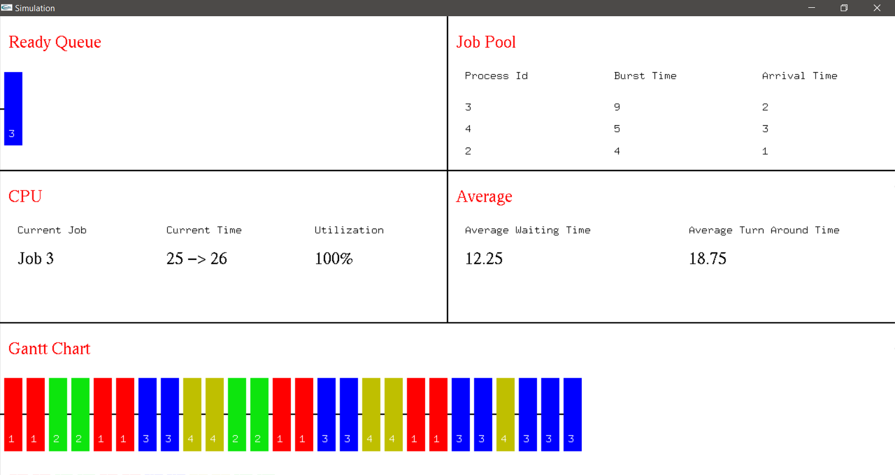

# OS Scheduling Algorithms Simulation
A simulator application to simulate the working of various CPU scheduling algorithms. It uses the OpenGL API in C++ for graphics rendering. The implementation makes use of Multi-Threading to decouple data computation from graphics rendering. The computation thread yields output in steps and waits for the graphics thread to consume it, which increases parallelism and avoids any blocking for graphics thread.
## Scheduling Algorithms
* First Come First Serve
* Shortest Job First Preemptive
* Round Robin Preemptive
## Screenshots
* **First Come First Serve**

* **Shortest Job First Preemptive**

* **Round Robin Preemptive**

